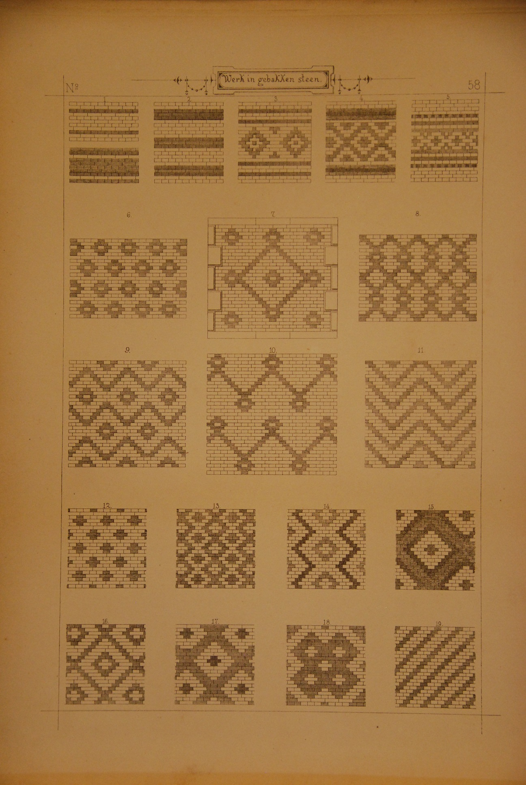
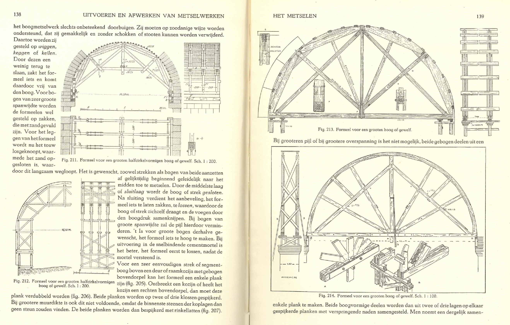
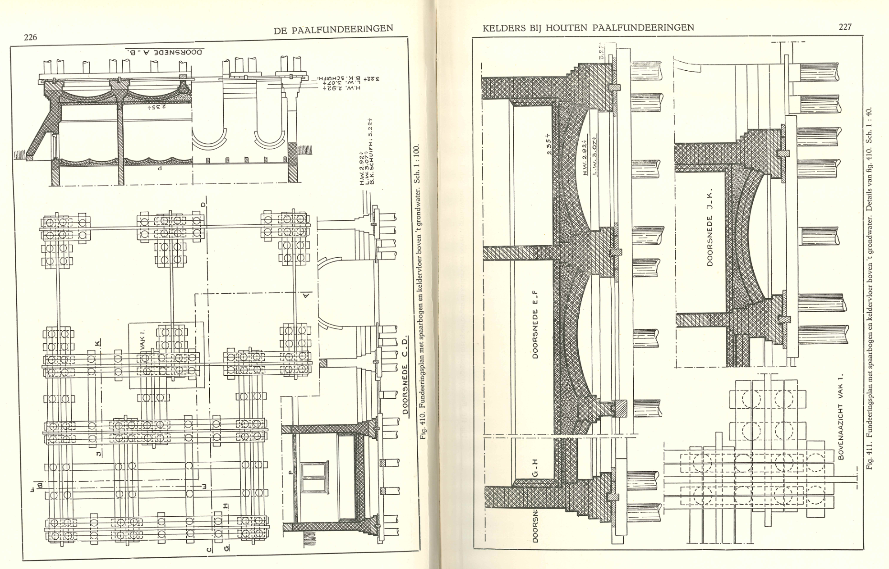
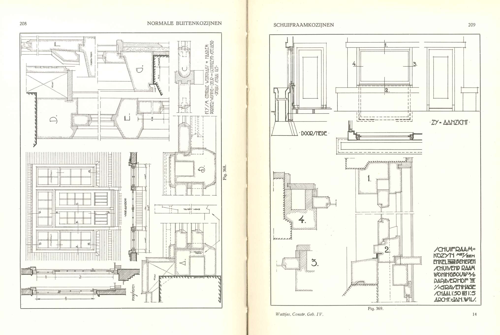
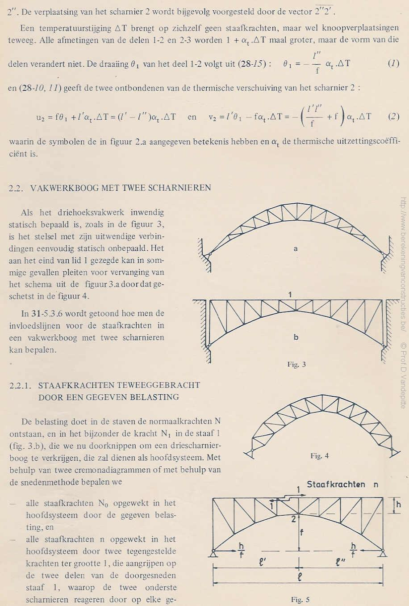
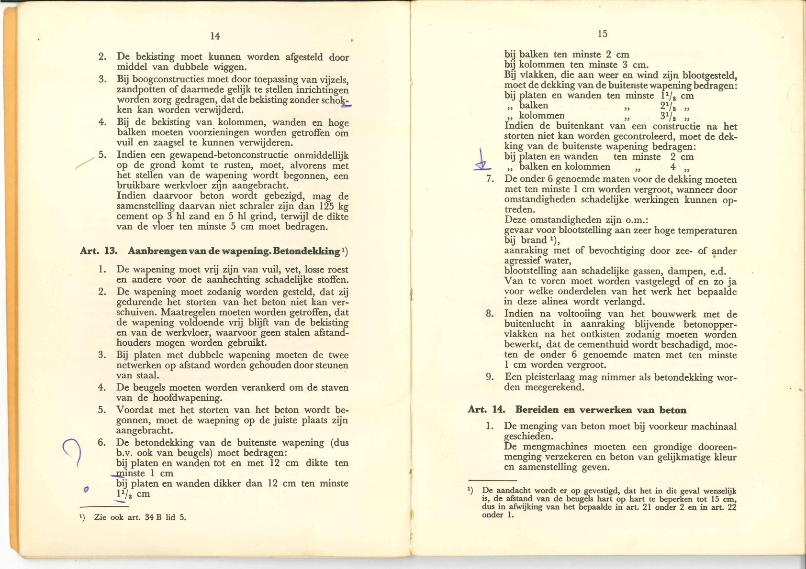
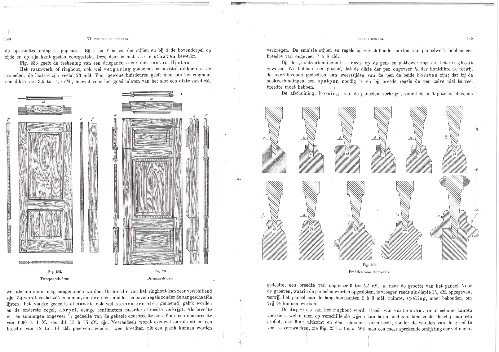

# Inleiding

Deze repository is onderdeel van OpenAEC. Deze repository bevat oude bouwkundige en architectonische boeken.

Het is begonnen uit frustratie omdat ik zelf jarenlang gezocht heb naar de boeken van [Prof. E.H. Gugel](https://nl.wikipedia.org/wiki/Eugen_Gugel) en van [Prof. J.G. Wattjes](https://nl.wikipedia.org/wiki/J.G._Wattjes) via boekwinkeltjes.nl en dat deze nauwelijks tweedehands verkrijgbaar waren.

* Deze boeken zijn voor zover te achterhalen vrij van rechten. 
* Het zijn erg nuttige boeken die niet tot nauwelijks 2e hands te koop zijn.
* Daardoor is de kennis die hierin staat helaas niet meer te gebruiken door Ingenieurs, Architecten en Bouwmeesters. 

# Rechten
* Het is soms erg lastig om te achterhalen of er auteursrechten op de boeken zitten.
* Mocht ik mij vergissen inzake de auteursrechten dan verzoek ik u contact op te nemen via maarten@3bm.co.nl. In dat geval zal ik de boeken per ommegaande verwijderen van dit project.

# Huidige collectie
* [Prof. E.H. Gugel](https://nl.wikipedia.org/wiki/Eugen_Gugel) Architectonische Vormenleer Platen
* [Prof. J.G. Wattjes](https://nl.wikipedia.org/wiki/J.G._Wattjes) Deel 2 Vrijstaande schoorsteenen haarden en smitsen
* [Prof. J.G. Wattjes](https://nl.wikipedia.org/wiki/J.G._Wattjes) Deel 3 Funderingen en Kelders Rioleeringen
* [Prof. J.G. Wattjes](https://nl.wikipedia.org/wiki/J.G._Wattjes) Deel 4 Ramen Deuren Kozijnen
* [Prof. J.G. Wattjes](https://nl.wikipedia.org/wiki/J.G._Wattjes) Deel 5 Binnen en buitenbetimmeringen leidingen
* [Prof. D. Vandepitte](https://nl.wikipedia.org/wiki/Dani%C3%ABl_Vandepitte) Berekening van constructies Deel I
* [Prof. D. Vandepitte](https://nl.wikipedia.org/wiki/Dani%C3%ABl_Vandepitte) Berekening van constructies Deel II
* [Prof. D. Vandepitte](https://nl.wikipedia.org/wiki/Dani%C3%ABl_Vandepitte) Berekening van constructies Deel III
(Deze is in het verleden gedownload van de website: www.berekeningvanconstructies.be die helaas niet meer bestaat)
* GBV 1950 Gewapend Beton Voorschriften

# Toekomstige collectie
* Overige boeken van [Prof. J.G. Wattjes](https://nl.wikipedia.org/wiki/J.G._Wattjes).
* Oudere betonnormen.
* Oude tijdschriften over de bouw.
* Boeken van reannissance architecten enz.

# Doelstellingen binnen OpenBooks
* Verbeteren en bijsnijden ingscande afbeeldingen tot een zodanige kwaliteit dat deze gebruikt kan worden voor reprints. 
* Integreren in aparte website.
* Tekst met OCR leesbaar en herkenbaar maken.
* Zorgen voor vindbaarheid in Google.
* Alle tekeningen digitaliseren in DXF/SVG

# Prof. E.H. Gugel

# Prof. J.G. Wattjes deel 2

# Prof. J.G. Wattjes deel 3

# Prof. J.G. Wattjes deel 4

# Prof. D. VandePitte 

# GBV1950

# Paneeldeuren

